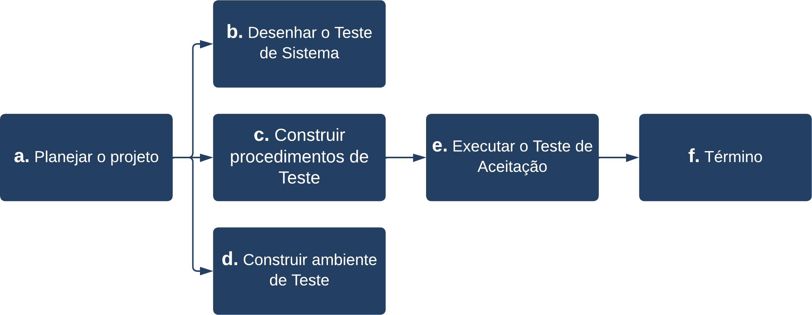

### 2.1 Requisitos que impactam na qualidade

| Requisito | Impacto na Qualidade |
| --- | --- |
| RNF001 - Tempo de resposta | O requisito impacta na percepção das informações e carregamento de telas pelo usuário. |
| RNF002 - Período Ativo | O requisito impacta no tempo em que o aplicativo deve permanecer funcionando, bem como em serviço. |
| RNF004 - Proteção contra ataques DDoS | O requisito impacta na segurança do sistema e também na disponibilidade, podendo ser vital para manter o sistema funcionando corretamente. |
| RNF005 - Criptografia | O requisito impacta na segurança do sistema, sendo vital para preservar a privacidade dos usuários e sua segurança. |
| RNF007 - Documentação da API REST | O requisito impacta na capacidade de realizar manutenções, sendo vital para um bom entendimento do webservice. |

### 2.2 Características que impactam no tamanho do software

| Característica da Arquitetura | Impacto no tamanho |
| --- | --- |
| Framework de desenvolvimento para dispositivos móveis (React native) | O framework utilizado e seu SDK auxiliar (Expo) influenciam no tamanho do aplicativo final, que possui no mínimo 50MB de comprimento. |

### 2.3 Características que impactam no desempenho do software

O desempenho que o Seja UPE deve conter está descrito de acordo com as características abaixo, estão relacionados a velocidade do sistema e o retorno para o usuário fazendo com o que o usuário final não espere muito tempo para ter suas respostas.

| Característica da Arquitetura | Impacto no desempenho |
| --- | --- |
| Capacidade de usuários | O aplicativo deve suportar até 100 pessoas simultaneamente, dada as dimensões do servidor. |
| Taxa de Transferência | O servidor deve possuir uma largura de banda de no mínimo 30MB de Upload e 50MB de Download. |
| Tempo de Resposta | O servidor deve responder em até 1000 milissegundos por cada requisição. |

### 2.4 Abordagem de testes utilizada e como ela impacta na arquitetura

### 2.5 Escolhas tecnológicas e seu impacto na qualidade do software
