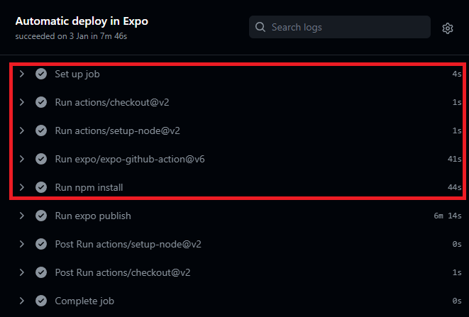
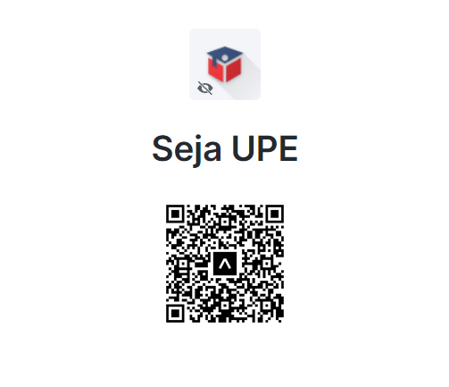

### 3.1 Infraestrutura

Para que o projeto possa ficar em execução por 24 horas por dia, 7 dias por semana é necessário hospedar o daemon da API REST em um servidor que suporte o Node.js na versão 12 ou superior.<br><br>
No cenário do **Seja UPE**, o servidor utilizado para hospedagem do sistema foi um servidor de placa única do tipo ASUS Tinkerboard com as seguintes especificações:

- Processador RK3288 Cortex-A17 SoC Quad-core;
- GPU ARM Mali-T760 MP4;
- Vídeo HDMI (resolução máxima de 4K) e MIPI DSI de 15 pinos (suporta até HD);
- Memória Dual Channel LPDDR3 2GB;
- Armazenamento em MicroSD(TF) de 32GB Sandisk Classe 10;
- Áudio com Codec RTL ALC4040;
- 4 Portas USB 2.0;
- Fonte de alimentação Monkey Business BR de 5 Volts DC/3 Ampères;
- Dimensões 3.37'' x 2.125'' (8.55cm x 5.4cm).

Além do servidor onde a API REST é hospedada, há um provedor externo de serviço de proteção DDoS e cache com rede AnyCast otimizada para redução de latência e encaminhamento inteligente baseado em geolocalização de resolução DNS, este provedor é o CloudFlare. O CloudFlare age como uma barreira de proteção pois assume o controle do nome de domínio e utiliza **proxies reversos** para filtrar requisições suspeitas e conter ataques de Slow Post, DDoS, SYN Flood, explorações genéricas e injeções de código em geral (principalmente SQL). Dessa forma, quando o usuário se conecta ao **Seja UPE**, na realidade está a se conectar ao servidor proxy do CloudFlare o qual mascara e oculta o real endereço de IP do servidor TinkerBoard.

>[!TIP]
>Faça o teste você mesmo, execute ``ping -n 1 sejaupe.website`` e veja o endereço de IP retornado. Copie esse endereço de IP e pesquise por ele em um banco de dados Whois e verá que o provedor é o CloudFlare Inc. e não o VcNet, conforme esperado.

A infraestrutura de rede do sistema **Seja UPE** conta também com outro proxy reverso, esse chamado Magic Proxy. O Magic Proxy possui recursos de balanceamento de carga Round-Robin e também um Gateway Websocket que roteia as conexões Websocket para um endereço virtual (roteamento baseado em domínio). Com isso, dentro da Tinkerboard R/BR é possível implantar dezenas de serviços Web e APIs que compartilham a mesma porta 80 (HTTP) e 443 (HTTPS). Essa técnica é conhecida como **Virtual Host** e é possível graças à RFC2616 que determina que toda requisição HTTP 1.1 deva possuir o cabeçalho Host da origem da requisição. O Magic Proxy então utiliza esse cabeçalho para descobrir qual foi o domínio envolvido na requisição e internamente roteia para o webservice ou API corretamente configurado para aquele domínio.

>[!ATTENTION]
>Note que muitas hospedagens compartilhadas utilizam desse recurso, como por exemplo o Heroku, Hostinger, Hostgator, entre outros. Por essa razão, há desvantagens significativas do ponto de vista arquitetural, pois se o cliente não estiver utilizando o protocolo HTTP 1.1 ou superior, essa técnica de roteamento não funciona. Dessa forma, não é possível rotear conexões TCP, pois não são acompanhadas de um indicador de cabeçalho Host. Essa técnica restringe o roteamento ao protocolo HTTP 1.1 e superior, bem como Websockets. Conexões TCP feitas diretamente ao endereço de IP do servidor de origem são dropados automaticamente, ocasionando o erro ERR_EMPTY_RESPONSE.

Por trás da API REST tem um banco de dados local, trata-se do SQLite. O SQLite é um banco de dados de arquivo único que não possui o suporte de um Sistema de Gerenciamento de Banco de Dados. Com o SQLite a aplicação insere, atualiza, consulta e apaga dados a qualquer momento utilizando um driver de banco de dados apropriado para Node.js, nesse caso node-sqlite.

>[!TIP]
>O SQLite é amplamente utilizado no Node.js, o TypeORM utiliza um dos drivers que você instala para se comunicar com o banco de dados, nesse caso o driver é o node-sqlite. Com esse driver o TypeORM consegue interagir com a base abstraindo todas as consultas SQL em relações de composição e herança baseadas no paradigma orientado a objetos. 

Finalizando a visão geral da infraestrutura do sistema, temos a parte que diz respeito ao usuário, seu dispositivo móvel. A aplicação móvel funciona através de um sistema operacional Android, mas devido a escolha da tecnologia de front-end, pode ser facilmente portável para iOS e demais sistemas operacionais. O cliente, que nesse caso está de posse do aparelho, utiliza o sistema que internamente desencadeia, eventualmente, uma série de solicitações através do protocolo HTTP 1.1 ao serviço de API REST. Todas as requisições feitas são stateless, necessitando do Json Web Token recebido no processo de autenticação SSO OAuth2 para manter o servidor ciente da sessão do usuário.

Ao longo desse tópico você pôde entender um pouco da infraestrutura do sistema, desde o hardware envolvido, aos serviços de terceiros na nuvem responsável pela proteção, banco de dados, detalhes de redes de computadores e por fim o hardware e software do usuário final. Nas seções seguintes abordaremos como o versionamento de código é feito utilizando Git, GitHub e GitFlow, assim como algums estratégias de DevOps que foram utilizadas para manter os serviços do Seja UPE, publicação e acesso de desenvolvimento na esteira de desenvolvimento do Expo Go.

### 3.2 Versionamento

O versionamento de código é um importante pilar do projeto **Seja UPE** pois todo o código-fonte tanto do front-end como do back-end é armazenado em repositórios no GitHub pertencentes à organização ``React Native Group``. O Git fornece inúmeras vantagens do ponto de vista de desenvolvimento pois permite que várias versões sejam criadas do código fonte e cada alteração seja devidamente catalogada em uma espécie de histórico. Essas diferentes versões do código são os commits, que pouco a pouco os desenvolvedores criam para introduzir novos trechos de código, arquivos e funcionalidades com a finalidade de incrementar o software. O **Seja UPE** possui dois repositórios, o **Seja-UPE** e o **Seja-UPE-API**, que hospedam o código da aplicação móvel e da API REST, respectivamente. Em cada repositório desse há uma branch ``main`` que é a branch principal, onde o código de produção está hospedado. Para que os desenvolvedores possam introduzir novas funcionalidades no sistema, é necessário adotar um modelo de versionamento de branchs para versionar o código e permitir que outros desenvolvedores colaborem com suas funcionalidades mas em branchs separadas para evitar conflitos, como ocorreria se todos os desenvolvedores utilizassem a branch main. Esse modelo de versionamento de branchs é o GitFlow, que será visto a seguir.

<p align="center">
  
</p>

O GitFlow, como mencionado, é um modelo de versionamento de branchs para repositórios Git que divide a responsabilidade de desenvolvimento em diferentes branchs. O fluxo geral do Gitflow é:

1. Uma ramificação ``develop`` é criada a partir de ``main``;
2. Uma ramificação ``release`` é criada a partir de ``develop``;
3. As ramificações ``feature`` são criadas a partir de ``develop``;
4. Quando a ``feature`` é concluída, ela é mesclada na ramificação ``develop``;
5. Quando o ``release`` é concluído, ela é mesclado nas ramificações ``develop`` e ``main``;
6. Se um problema for detectado na ramificação ``main``, uma ramificação ``hotfix`` será criada a partir de ``main``;
7. Uma vez que o ``hotfix`` é concluído, ele é mesclado para ambos ``develop`` e ``main``.

As branchs que compõem o GitFlow são:

1. **main** - Nessa branch é contido todo o código de produção. Sempre que a branch development possui estabilidade para ser liberada em produção, ela é então mesclada com essa branch;
2. **develop/development** - Nessa branch é contido o código de desenvolvimento. Esse código é constantemente alterado e recebe novos merges de branchs secundárias como **feature/\*** e **bugfix/\***. Essa branch não recebe código e commits diretamente, mas é alterada e recebe mesclagens das branchs citadas. Quando o código atinge maturidade para ir à produção, ela então é mesclada com a **main** após ser gerado um release na branch **release**;
3. **feature** - Cada nova funcionalidade criada deve ter uma branch associada com o prefixo **feature/\***. O desenvolvedor deve trabalhar nessa branch e quando concluir sua funcionalidade mesclar com a branch **develop/development** através de um Pull Request;
4. **bugfix** - Correções de bugs e problemas no sistema devem ser feitas a partir de branchs com esse prefixo (**bugfix/\***). Quando uma correção é concluída e precisa ser mesclada com o código em desenvolvimento, o desenvolvedor deve então mesclar essa branch com a **develop/development** também através de um Pull Request;
5. **hotfix** - Correções críticas que devem entrar diretamente em ambiente de produção (**main**) devem ser feitos a partir de branchs com o prefixo **hotfix/\***. O desenvolvedor deve trabalhar na correção e, uma vez concluída, abrir um Pull Request para mesclar suas alterações com a branch **main** e também com a branch **develop/development**;
6. **release** - Nessa branch, a cada lançamento de código estável da **develop/development** deve ser enviado para a branch release para manter o histórico de lançamentos realizados e suas versões.

O próprio git facilita a utilização do GitFlow pois seu utilitário de linha de comando fornece a possibilidade de se trabalhar com cada uma dessas branchs mencionadas sem ter de criá-las na mão. 

>[!TIP]
>O commando ``git flow feature start <nome-da-funcionalidade>`` é um exemplo de instrução que pode ser utilizada para criar uma nova funcionalidade seguindo o padrão do GitFlow. Após a criação da funcionalidade, uma nova branch será gerada com o nome ``feature/<nome-da-funcionalidade>``. Para finalizar a branch e mesclá-la com a development, o comando é muito parecido, mudando apenas o termo start por finish: ``git flow feature finish <nome-da-funcionalidade>``. Para mais informações, consulte este [**cheatsheet**](https://danielkummer.github.io/git-flow-cheatsheet/).

Agora que você conhece o modelo de fluxo de trabalho utilizado no versionamento Git, há mais alguns padrões importantes que o **Seja UPE** adota com relação aos commits nos repositórios. São dois padrões utilizados para criar um commit, o primeiro é um lintter chamado ``Gitmoji`` que utiliza Emojis para classificar commits e marcá-los quanto a seu propósito. Cada Emoji possui um um significado e torna mais fácil entender o que o commit faz quando esse emoji é prefixado no título do commit. O Gitmoji proporciona dezenas de Emojis para serem utilizados.

>[!TIP]
>O Gitmoji pode ser instalado seguindo as instruções em [**Gitmoji Docs**](https://gitmoji.dev/). Para começar a utilizá-lo, ao invés de executar o comando ``git commit -m "minha-mensagem"`` você deverá utilizar o comando ``gitmoji -c``.

Por último, mas não menos importante, há o segundo padrão de commit chamado ``Conventional Commits`` que é responsável por prefixar um termo no título do commit. Esse padrão de commit propõe que seja utilizada uma palavra para descrever a ação realizada no commit e facilitar para quem está a procura de certos commits e alterações realizadas, sem necessitar abrir o commit para ver quais alterações foram feitas. O ``Conventional Commits`` toma emprestado alguns termos da ``Convenção Angular``, que é um padrão amplamente utilizado na Google pelos desenvolvedores do Angular. Alguns dos termos são:

- ``fix`` (Correções de bugs);
- ``feature`` (Adição de nova funcionalidade);
- ``BREAKING CHANGE`` (Mudanças radicais/quebra de compatibilidade ou Major Release);
- ``build`` (Alterações referentes à configurações de build);
- ``chore`` (Alterações em arquivos de forma genérica, mudanças em pastas, renomeação de arquivos e pastas, mover diretórios);
- ``ci`` (Continuous Integration - Configurações referentes à Integração Contínua);
- ``docs`` (Alterações referentes à documentação do software);
- ``style`` (Alterações em estilos CSS, SCSS ou estilização de interface gráfica em geral);
- ``refactor`` (Alterações com propósito de refatorar o código-fonte do software);
- ``perf`` (Alterações que impactam na performance/desempenho do software);
- ``test`` (Alterações que adicionam ou modificam testes ou casos de teste).

>[!TIP]
>Um commit realizado no **Seja UPE** com a aderência dos padrões de commit apresentados resulta em algo parecido com: 📝 docs: Updated README informations.

### 3.3 DevOps

O DevOps é a combinação de filosofias culturais, práticas e ferramentas que aumentam a capacidade de uma empresa de distribuir aplicativos e serviços em alta velocidade: otimizando e aperfeiçoando produtos em um ritmo mais rápido do que o das empresas que usam processos tradicionais de desenvolvimento de software e gerenciamento de infraestrutura. Essa velocidade permite que as empresas atendam melhor aos seus clientes e consigam competir de modo mais eficaz no mercado.

<p align="center">
  
</p>

#### Benefícios do DevOps

- **Velocidade**

  Opere em alta velocidade para que você possa trazer inovações para os seus clientes mais rapidamente, adaptar-se melhor a mercados dinâmicos e tornar-se mais eficiente na geração de resultados comerciais. O modelo de DevOps permite que as suas equipes de desenvolvedores e operações atinjam esses resultados. Por exemplo, os microsserviços e a entrega contínua permitem que as equipes assumam a responsabilidade sobre os serviços e, então, lancem atualizações para eles mais rapidamente.

- **Entrega rápida**

  Aumente a frequência e o ritmo de lançamentos para poder inovar e melhorar seu produto mais rapidamente. Quanto mais rápido você puder lançar novos recursos e corrigir erros, maior será a sua agilidade para responder às necessidades dos clientes e criar vantagem competitiva. A integração e a entrega contínuas são práticas que automatizam o processo de lançamento de software, da fase de criação à fase de implantação.

- **Confiabilidade**

  Garanta a qualidade das atualizações de aplicativos e alterações de infraestrutura para que você possa entregar com confiança em um ritmo mais rápido, sem deixar de manter uma experiência positiva para os usuários finais. Use práticas como a integração e a entrega contínuas para testar se cada umas das alterações funciona e é segura. As práticas de monitoramento e registro em log ajudam você a permanecer informado sobre a performance em tempo real.

- **Escala**

  Opere e gerencie seus processos de infraestrutura e desenvolvimento em escala. A automação e a constância ajudam você a gerenciar sistemas complexos ou dinâmicos com eficiência e risco reduzido. Por exemplo, a infraestrutura como código ajuda você a gerenciar seus ambientes de implantação, teste e produção de modo repetido e mais eficiente.

- **Colaboração melhorada**

  Crie equipes mais eficientes em um modelo cultural de DevOps, que enfatiza valores como propriedade e responsabilidade. As equipes de desenvolvedores e operações colaboram de perto, compartilham muitas responsabilidades e combinam seus fluxos de trabalho. Isso reduz ineficiências e economiza tempo (por exemplo, períodos de transferência reduzidos entre desenvolvedores e operações, desenvolvimento de código que considera o ambiente em que é executado).

- **Segurança**

  Opere rapidamente enquanto mantém o controle e preserva a conformidade. Você pode adotar o modelo de DevOps sem sacrificar a segurança usando políticas de conformidade automáticas, controles minuciosos e técnicas de gerenciamento de configuração. Por exemplo, usando a infraestrutura e a política como código, você pode definir e acompanhar a conformidade em escala.

#### 3.3.1 GitHub Actions Pipelines

<p align="center">
  
</p>

```yml
name: Expo Automatic Deploy
on:
  push:
    branches: [main]
jobs:
  publish:
    name: Automatic deploy in Expo
    runs-on: ubuntu-latest
    steps:
      - uses: actions/checkout@v2
      - uses: actions/setup-node@v2
        with: 
          node-version: 14.x
      - uses: expo/expo-github-action@v6
        with:
          expo-version: 4.x
          token: ${{ secrets.EXPO_TOKEN }}
      - run: npm install
      - run: expo publish
```

#### 3.3.3 Build automático

<p align="center">
  
</p>

#### 3.3.4 Deployment automático

<p align="center">
  
</p>

#### 3.3.5 GitHub Webhooks Notifications no Discord

<p align="center">
  
</p>

### 3.4 PlayStore

### 3.5 Expo Go

<p align="center">
  
</p>
