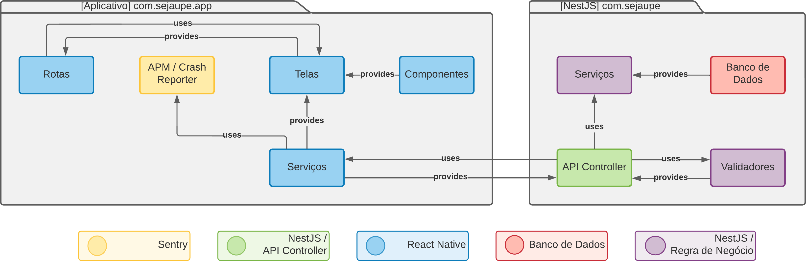

### Como a arquitetura está sendo exibida (C4 Model)?

### O que é o C4 Model?
### Como ler a documentação da forma correta?

### Principais tecnologias envolvidas

### Acrônimos

### Proposta do sistema
